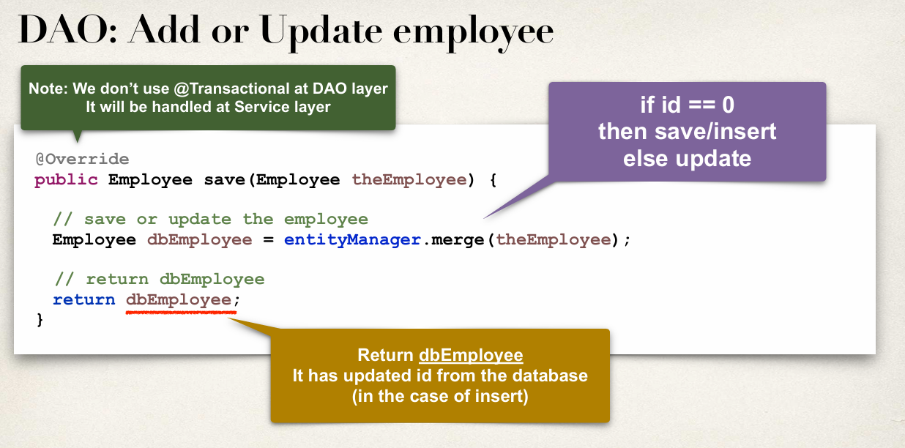
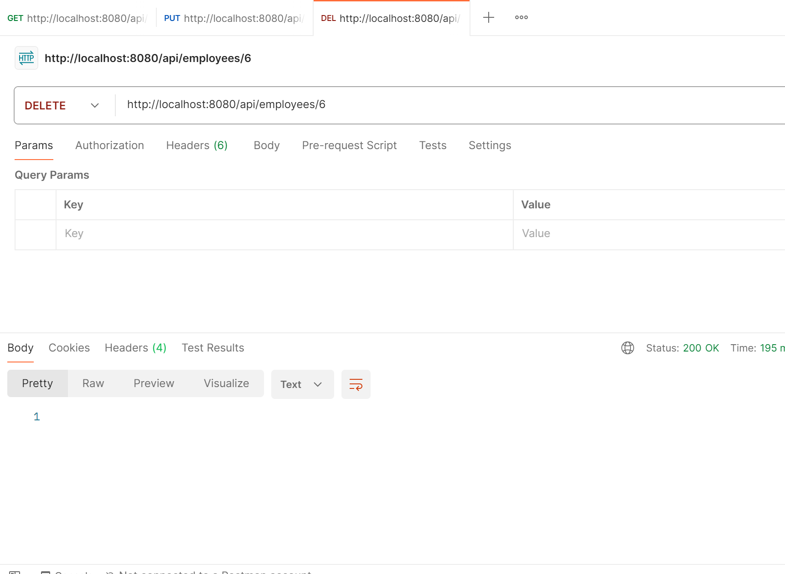

### REST API Client Requirements | April 14, 2025

## Spring Boot REST API Design - Best Practices by Chad Darby - Refresher
### REST API Design
- For real time projects, who will use your API?
  Also, how will they use your API?
  Design the API based on requirements
### API Design Process
- Review API requirements
- Identify main resource / entity
- Use HTTP methods to assign action to resource
### Step 1. Ex. API requirements from the Boss
- Create a REST API for the Employee Directory
- Get a list of employees
- Get a single employee by ID
- Add new employee
- Update an employee
- Delete an employee
  `Full Crud Operations`
### Step 2. Identify main resource / entity
- Identify main resource / entity, look for the most prominent "noun"
- For the project, its "employee"
- Convention is to use plural form of resoure / entity: employees
`ex. /api/employees`
- Note: this is the General Convention in the REST API Design
- ➡️ Step 3. Use HTTP methods to assign action to resource

### API Examples
- Paypal - invoicing api
- Github - repositories api
- SalesForce -
- 
### Spring boot REST API

4. spring-boot rest api employee crud

- sql script file at 00-spring-boot folder

## 🗓️ Project Setup | April 14, 2025
## Create a Project in https://start.spring.io/
### Integrated Development Environment (IDE) IntelliJ or VScode
### API Testing Tool - Web Browser or POSTMAN for Advance tool
## Add the following dependencies:
- Spring Web
- Spring Data JPA
- Spring Boot DevTools
- MySQL Driver
- Lombok
- Mapstruct - maven repo 
- Mapstruct Processor - maven repo
- Mapstruct-Lombok Binding - maven repo
- Added SPRING SECURITY (4/26/2025)

### IntelliJ Configurations
- `File > Settings > Build, Execution, & Deployment > Compiler > Build Tools and checked ✅`
- `File > Settings > Advance Settings > Compiler > Checked ✅ - Allow auto-make to start even if the develop application is running`

### 🗓️ April 15, 2025
- Add Dependencies in POM.XML: Mapstruct, Mapstruct Processor, Mapstruct-Lombok Binding
- Add Path in Build POM.XML:
- ✅ In POM.XML file add the dependencies and path in annotationProcessPath
- ✅ Go to File > Settings > Build, Execution, Deployment > Compiler > Annotation Processors
- ✅ Check "Enable annotation processing" & Obtain processor in the classpath
Rebuild project:
- ✅ mvn clean install or Build > Rebuild Project in IntelliJ
- ✅ Restart your app and try the endpoint again
### For Mapping of model & dto
- ✅ Create Model ex. Employee Class
- ✅ Create DTO  ex. EmployeeDto Class
- DTO https://medium.com/@mariorodrguezgalicia/what-is-a-dto-in-spring-boot-and-why-should-you-use-it-97651506e516
- ✅ Create EmployeeMapper interface & add mapping
- ✅ mvn clean install or Build > Rebuild Project in IntelliJ
- ✅ View the Target Folder > Find Generated Sources

- Mapstruct Docs: https://mapstruct.org or
  https://mapstruct.org/documentation/stable/reference/pdf/mapstruct-reference-guide.pdf-

## SPRING BOOT REST DAO (DATA ACCESS OBJECT)

### Development Process
1. Update `application.properties` add JDBC Properties below:
- `spring.datasource.url=jdbc:mysql://localhost:3306/employee_directory`
- `spring.datasource.username=springboot`
- `spring.datasource.password=springboot`
- `spring.datasource.driver-class-name=com.mysql.cj.jdbc.Driver`
- `spring.jpa.hibernate.ddl-auto=update`
- `spring.jpa.open-in-view=false`
- `spring.jpa.show-sql=true`
- s`pring.jpa.properties.hibernate.format_sql=true`
2. Create Employee Entity (I Added DTO for mapstruct mapping)
- DTO https://medium.com/@mariorodrguezgalicia/what-is-a-dto-in-spring-boot-and-why-should-you-use-it-97651506e516
3. Create DAO interface (Crete methods)
4. Create DAO implements (Implement methods)
- Add **`@Repository annotation`** in Spring is a specialized stereotype annotation used to indicate that a particular class is a Data Access Object (DAO) — a class responsible for interacting with the database. 
5. Create REST controller to use DAO

### 🗓️ April 16, 2025

## Refactor: Add a `Service Layer`
### Purpose of Service Layer
- ✤ Service Facade design pattern
- ✤ Intermediate layer for custom business logic
- ✤ Integrate data from multiple sources (DAO/repositories)
- Application Architecture `ex. Employee Rest Controller <---> Employee Service <---> Employee DAO <--->  Database`

### Specialized Annotation for Services
- @Service applied to Service implementations
- Spring will automatically register the Service implementation
- thanks to component-scanning

### 🗓️ April 17, 2025
## @PatchMapping

### Patch Testing
- DB

- Postman

- DB check update

- Validation not allowed on changing id

- Delete

### Global Exception Handling
- @ControllerAdvice annotation is used to define a global exception handler that applies to all controllers within the application. This approach centralizes exception handling, allowing you to manage errors consistently across your application without duplicating code in each controller.

### Key Features of @ControllerAdvice
- Global Exception Handling: By annotating a class with @ControllerAdvice, you can handle exceptions thrown by any controller method. This eliminates the need to define exception handlers in each controller individually.
- Integration with @ExceptionHandler: Within a @ControllerAdvice-annotated class, you can define methods annotated with @ExceptionHandler to specify how particular exceptions should be handled.

### Difference Between @ControllerAdvice and @RestControllerAdvice
- While @ControllerAdvice is suitable for applications that return views (e.g., HTML pages), @RestControllerAdvice is a specialized version designed for RESTful APIs. It combines @ControllerAdvice with @ResponseBody, ensuring that the responses from exception handlers are serialized directly into the HTTP response body, typically as JSON.

`Use @RestControllerAdvice when building REST APIs that need to return structured error responses in JSON format.`

### Benefits of Using @ControllerAdvice
- Centralized Error Handling: Manage all exceptions in a single location, promoting cleaner and more maintainable code.
- Consistent Responses: Ensure that your application returns consistent error responses, improving the client-side handling of errors.
- Separation of Concerns: Keep your controller logic focused on handling requests and delegating business logic, while the @ControllerAdvice class manages error scenarios.

### Best Practice
- Global Exception Handling
- Multiple service can throw multiple exception
- For Real Time Projects or Large Scale Development

### Global Exception Development Process
- Create new Controller Advice Class: `EmployeeRestExceptionHandler.java`
- Add exception handling code to @ControllerAdvice
- Create Response Error Class with Status, Message, & Timestamp: `EmployeeResponseError.java`
- Create Employee Exception class thi will be used to extend the Runtime Exc: `EmployeeNotFoundException.java`
- Refactor REST Service Controller temporary Runtime Exc handling code

### 🗓️ April 26, 2025

- Added SPRING SECURITY Dependency
- Spring Security is a powerful framework that's part of the Spring ecosystem designed to handle authentication and authorization in Java applications.
- In simple words: Spring Security protects your app — it decides who can log in, what they can access, and what they can't.

### What Spring Security does:
- Authentication = checking who the user is (e.g., login form, username + password).
- Authorization = checking what the user is allowed to do (e.g., only admins can delete users). 
- Password Encryption = securely stores passwords. 
- Security Filters = protects APIs, URLs, forms automatically. 
- Role-Based Access Control (RBAC) = e.g., ADMIN, USER, etc. 
- Session Management = prevents session hijacking. 
- CSRF Protection = prevents Cross-Site Request Forgery attacks. 
- OAuth2, JWT support = you can use tokens, social login (Google, Facebook) if needed.

### Where it's commonly used: 
- Protect login/logout functionality. 
- Control which pages different users can see. 
- Secure REST APIs. 
- Add two-factor authentication (2FA). 
- Integrate with OAuth2 providers (Google, GitHub login).

### Note 📝 - spring security has a default login page
- Used the default spring security features. Below the default access
  - Default username is: user
  - Default password in run application terminal it auto generates the password
    - `Using generated security password: 97d8a542-90b8-4341-9788-e05d3bf1662b`
- Custom username & password you can set it to `application.properties` ex.
  - `spring.security.user.name=jamer`
  - `spring.security.user.password=test123`